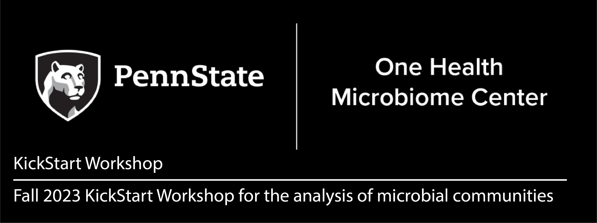

# KickStart-Workshop-2023
Materials for the Fall 2023 PSU One Health Microbiome Center KickStart Workshop

## Details
**Dates**: August 9 - 11, 2023  
**Time**: 9am - 5pm each day  
**Location**: In person in 106 AVBS

### Tutors:
- David Koslicki	(dmk333@psu.edu)
- Emily Davenport	(exd44@psu.edu)  
- Sharifa Crandall	(sgcrandall@psu.edu)  
- Estelle Couradeau	(efc5279@psu.edu) 
- Darrell Cockburn	(dwc30@psu.edu)  
- Erika Ganda		(ganda@psu.edu)
- Francisco Dini-Andreote (co-chair)	(adreote@psu.edu)
- Nichole Ginnan (co-chair)	(nginnan@psu.edu)

### TAs:
- Jamie Spychalla
- Abby Gancz
- Christine Ta
- Daniela Betanurt
- Hanh Tran

## Requirements
A PSU email and access to Penn State’s Roar system is required prior to the workshop. You can do this by going to https://accounts.aci.ics.psu.edu, and entering your information.  For the purposes of this workshop, please list Francisco Dini Andreote (fjd5141) as your account sponsor and put "2023 Microbiome Center Summer Workshop" into the "Research Description" field of the account request form. 

A laptop is also required for the workshop. You can either bring your own or email Nichole Ginnan (nginnan@psu.edu) before _July 28th_ to rent one for free. 

## Schedule
- Day 1 morning (8:30am - 12pm): Intro + [Basics of Microbiome Analysis - From Planning to Sequencing](/Day1-MicrobiomeAnalysisBasics) - Organizing Committee
- Day 1 afternoon (1pm - 5pm) [OPTIONAL]: [Unix Basics and Intro to R Programming](/Day1-UnixBasics) - Emily Davenport  
- Day 2 morning (10am - 12pm): [Metabolomics](/Day2-Metabolomics) - Josh Kellogg
- Day 2 afternoon (1pm - 5pm): [Amplicon Data Analysis in R](/Day2-AmpliconR) - Sharifa Crandall and Erika Ganda
- Day 3 afternoon (12:30 - 2pm): [Principles of Symbiosis](/Day3-Symbiosis) - Liana Burghardt
- Day 3 afternoon (2pm - 5pm): [Shotgun data analysis (assembly, binning, and profiling)](Day3-Shotgun/README.md) - David Koslicki
- Day 3 afternoon (5pm - ) [OPTIONAL]: Happy Hour Downtown [TBD]
